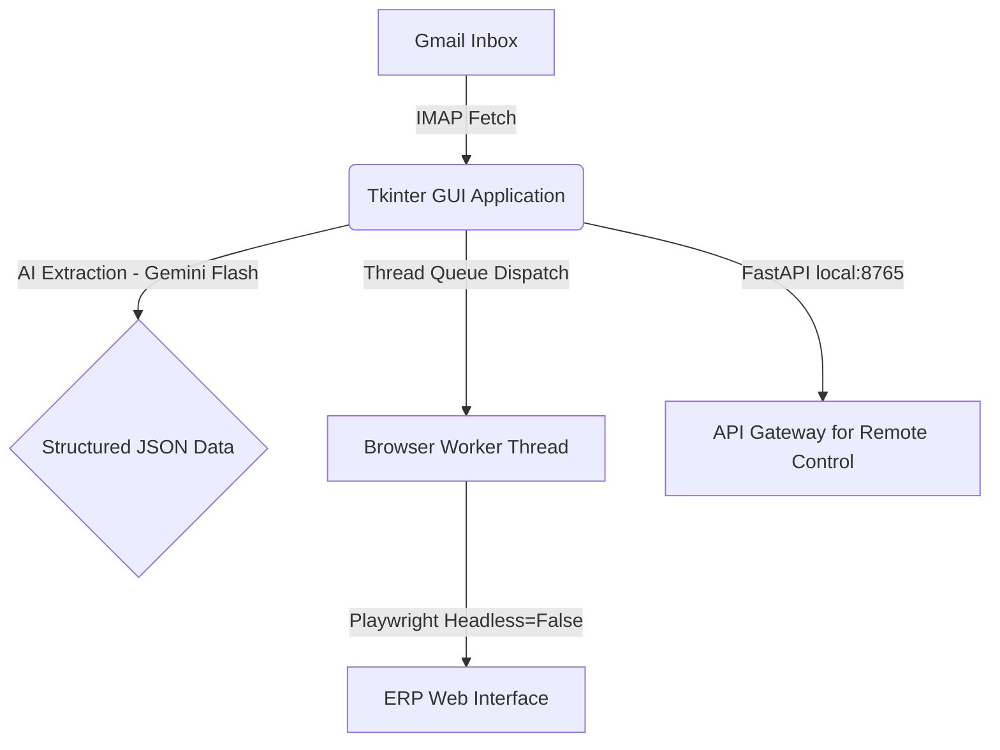

# 📄 ERP Order Ingestion System: Architecture & Recovery Manual

This manual serves as the single source of truth for the **ERP Order Ingestion System** developed for the Antigravity project. It documents the core architecture, mental models, prompt strategies, and specific code workarounds required to maintain 100% stable operation.

---

## 🛠️ 1. Core Architecture & Component Roles

The pipeline relies on a hybrid framework combining a desktop GUI, background threads, and direct browser automation.



### Key Modules:
1. **`erp_data_entry.py` (Master Coordinator):**
   * **GUI Layer (Tkinter):** Provides manual validation, historical load/resubmit triggers, and logs.
   * **FastAPI Server (localhost:8765):** Runs as a background daemon, enabling remote systems (like Telegram Bot Swarms) to trigger scraping, read emails, populate fields, or command the browser.
   * **Playwright Worker Thread:** A dedicated, thread-safe message queue runner executing all automation tasks sequentially to prevent thread violations.
2. **`bot_erp_auto.py`:** Initiates headless or fully autonomous processing loops.
3. **`erp_profile` / `browser_profile`:** Local directories preserving Chromium sessions, cookies, and local storage to prevent multi-factor login checks on every run.

---

## 🧠 2. UI Component Workarounds & Playwright Strategies

The ERP portal utilizes heavily customized elements (Element UI, custom file uploaders, Bootstrap Select widgets). Standard `.click()` or `.fill()` actions fail. The following patterns have been successfully engineered and hardened:

### A. Element UI Date Picker (Cooperation Date)
* **Problem:** Direct keyboard entry or simple `.fill()` doesn't trigger the Angular/Vue internal state update. When moving to the next field, the date resets to today's date.
* **Solution:** The bot simulates a physical click on the input box, enters the date, waits for the picker popup, and explicitly clicks the **"确定" (Confirm)** button in the footer to bind the value.
```python
def fill_date_by_id(selector, value):
    try:
        el = page.locator(selector).first
        el.click(force=True)
        # Type the date value
        el.fill(value)
        page.wait_for_timeout(400)
        # Target Vue/Element UI Confirm button (确定)
        confirm_btn = page.locator('span:has-text("确定"), button:has-text("确定")').first
        if confirm_btn.count() > 0:
            confirm_btn.click(force=True)
            print("✓ Cooperation date confirmed via Element UI popup")
    except Exception as e:
        print(f"X Date Picker error: {e}")
```

### B. Bootstrap Select Dropdown (Country Selector)
* **Problem:** The country dropdown is a native `<select>` completely styled and hidden by a Bootstrap plugin wrapper. Choosing the value via standard option selecting is ignored by Vue/React bindings.
* **Solution:** A dual-strategy execution. First, it clicks the visual dropdown button wrapper to trigger the active DOM expansion. Next, it looks for the corresponding `li` item matching the country and clicks it. If that fails, it executes a clean, custom `selectpicker('val', ...)` dispatch via JavaScript evaluation.
```python
def select_bootstrap_dropdown(selector_id, option_value):
    # Strategy 1: Interactive expansion and selection
    try:
        # Click the dropdown trigger element
        page.locator(f"button[data-id='{selector_id}']").first.click(force=True)
        page.wait_for_timeout(400)
        # Select matching item list element
        list_item = page.locator(f"div.dropdown-menu.show ul li a:has-text('{option_value}')").first
        if list_item.count() > 0:
            list_item.click(force=True)
            return True
    except:
        pass
        
    # Strategy 2: Direct selectpicker API Injection
    page.evaluate(f"""() => {{
        const select = document.getElementById('{selector_id}');
        if (select) {{
            $(select).selectpicker('val', '{option_value}');
            select.dispatchEvent(new Event('change', {{ bubbles: true }}));
        }}
    }}""")
```

### C. Double-Button Image Uploaders (Avatars & Product Images)
* **Problem:** Selecting an image triggers a system file dialog box. If clicked directly via physical emulation, the OS file chooser blocks the entire Playwright execution. Clicking once loads the path, but a second upload trigger button is required to commit it to the website.
* **Solution:** Locate the hidden `<input type="file">` selector behind the buttons, set the file path directly using `set_input_files()`, then explicitly trigger the secondary upload button.
```python
def upload_by_id(uploader_id, file_path, label):
    try:
        # 1. Target the hidden file input
        file_input = page.locator(f"#{uploader_id} input[type='file']").first
        if file_input.count() > 0:
            file_input.set_input_files(file_path)
            page.wait_for_timeout(1000)
            
            # 2. Click the secondary upload button to confirm upload to server
            submit_btn = page.locator(f"#{uploader_id} button:has-text('Upload'), #{uploader_id} .btn-upload").first
            if submit_btn.count() > 0:
                submit_btn.click(force=True)
                page.wait_for_timeout(1500)
            print(f"✓ Uploaded {label} successfully")
    except Exception as e:
        print(f"X Image upload error ({label}): {e}")
```

### D. Correct Mapping of Influencer Agreements
* **Problem:** Agreement statements (e.g. "Influ agreed to collaborate and create a video...") were leaking into `#orderNote` (Order Note), leaving `#effectNote` (Promotion Effect Note) blank.
* **Solution:** Redirected agreements exclusively to `#effectNote`, preserving `#orderNote` for clear logistic notations.
```python
# Mapped specifically to #effectNote (效果备注)
ta = page.locator('#effectNote').first
if ta.count() > 0:
    ta.fill(str(effect_note))
```

---

## 🔒 3. Session Persistence & Crash Recovery Mechanics

### A. Browser Lifecycle Validation ("Anti-Nghủm" Protocol)
* **Problem:** If a user closes the Chrome automation window, the local variable `self.active_page` is not `None`. On subsequent runs, Playwright sends commands to a closed page, resulting in hidden failures and worker lockups.
* **Solution:** Before each form-fill, perform an operational alive test. If it throws an exception, discard the dead context and launch a fresh, responsive Chrome instance.
```python
# Check if browser is still alive and responsive. If closed/crashed, reset context.
browser_alive = False
if self.browser_ctx and self.active_page:
    try:
        # Accessing properties forces playwright to verify target is still open
        _ = self.browser_ctx.pages
        _ = self.active_page.url
        browser_alive = True
    except Exception:
        print("⚠️ Active browser context or page was closed/crashed. Resetting...")
        try: self.browser_ctx.close()
        except: pass
        self.browser_ctx = None
        self.active_page = None
```

### B. Redirect Buster & Login Interceptor
* **Problem:** Intermittent login timeouts cause the ERP backend to redirect form submissions to `https://erp.bx123.pro/401` or `/login`.
* **Solution:** Intercept these pages, force standard credential auto-fills, submit, and redirect back to the entry form.
```python
def auto_login_if_needed():
    try:
        current_url = page.url
        # Detect 401/403 unauthorized or session expired
        if any(x in current_url for x in ['/401', '/403', '/500']):
            print("⚠️ Detected unauthorized/error page (401/403). Navigating to login...")
            page.goto("https://erp.bx123.pro/login", wait_until="domcontentloaded", timeout=15000)
            page.wait_for_timeout(2000)
            current_url = page.url

        # Check for login indicators (URL or Presence of Login Form)
        if any(x in current_url for x in ['/login', '/admin/login', 'auth']) or page.locator('input[placeholder="账号"], input[name="username"]').count() > 0:
            print("🔐 Login page detected - Attempting auto-fill...")
            user_input = page.locator('input[placeholder="账号"], input[name="username"]').first
            if user_input.count() > 0: user_input.fill("panjinying")
            pass_input = page.locator('input[placeholder="密码"], input[type="password"]').first
            if pass_input.count() > 0: pass_input.fill("LIrong2025")
            page.wait_for_timeout(500)
            login_btn = page.locator('button:has-text("登陆"), button:has-text("登录"), input[type="submit"]').first
            if login_btn.count() > 0:
                login_btn.click()
                page.wait_for_load_state("networkidle", timeout=5000)
                page.wait_for_timeout(2000)
    except Exception as e: 
        print(f"Auto-login error: {e}")
```

---

## 🧠 4. Prompt Engineering & Extraction Models

Structured data is extracted using `gemini-2.5-flash` with direct JSON constraints:

```
You are an expert order processor. Extract the shipping and product information from the email body below.

EMAIL BODY:
{email_body}

Extract the following variables as a strict JSON object:
- nickname (the influencer's username/social name)
- contact_info (their email or phone number)
- consignee (recipient name)
- phone (phone number)
- country (target country)
- province (state or region)
- city (city of residence)
- address (detailed street address)
- postal_code (zip/postcode)
- product_link (any links to product pages)
- product_sku (attribute, size, color)

Return ONLY valid JSON. Do not include markdown wraps or comment blocks.
```

---

## 🚨 5. Recovery & Quick-Start Steps for the User

If the bot stops reacting, or you need to boot up a clean environment:

1. **Close any dead CLI/Terminal/Chrome windows.**
2. **Run `launch_erp.bat`:** This launches the UI and spins up the FastAPI server on port `8765`.
3. **If you get a 401 on the web screen:** The bot will automatically handle the login sequence using the built-in credentials within 5-10 seconds.
4. **Clean Profile Reset:** If the browser profile becomes corrupted, delete the folder `C:/erp_profile`. The bot will automatically recreate it on the next run.

---
> [!NOTE]
> All changes are saved locally inside [erp_data_entry.py](file:///C:/Trợ%20lý%20AI/erp_data_entry.py). If any automation actions fail, look at `last_browser_state.png` in the project root folder to see exactly what the bot was looking at.
